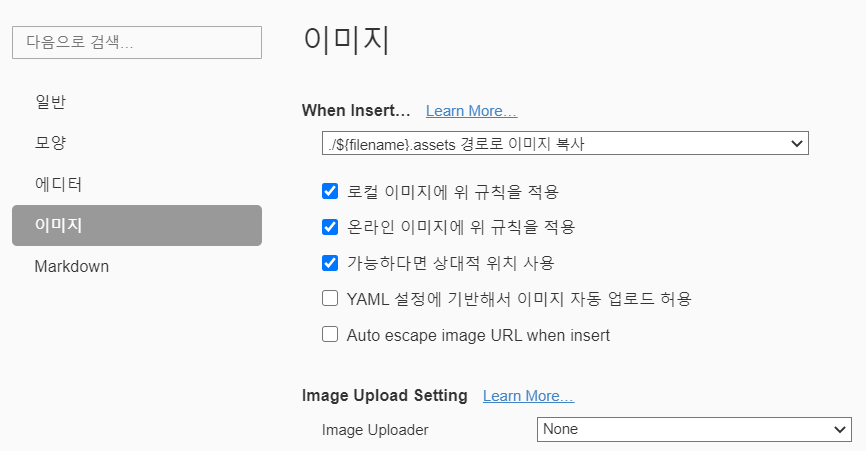

# Git_image

> Typora를 활용해 Git에 이미지를 쉽게 추가하는 방법

### Typora 설정 변경

- When Insert 변경
  - /${filename}.assets 경로로 이미지 복사
- 로컬 이미지에 위 규칙을 적용 
- 온라인 이미지에 위 규칙을 적용
- 가능하다면 상대적 위치 사용

### 원하는 범위 캡처 후 붙여넣기

- 캡처
  - windows키 + shift + s
- 붙여넣기

### 주의사항 

- 파일명에 공백이 있을경우 git에서 적용되지 않는 경우가 있음